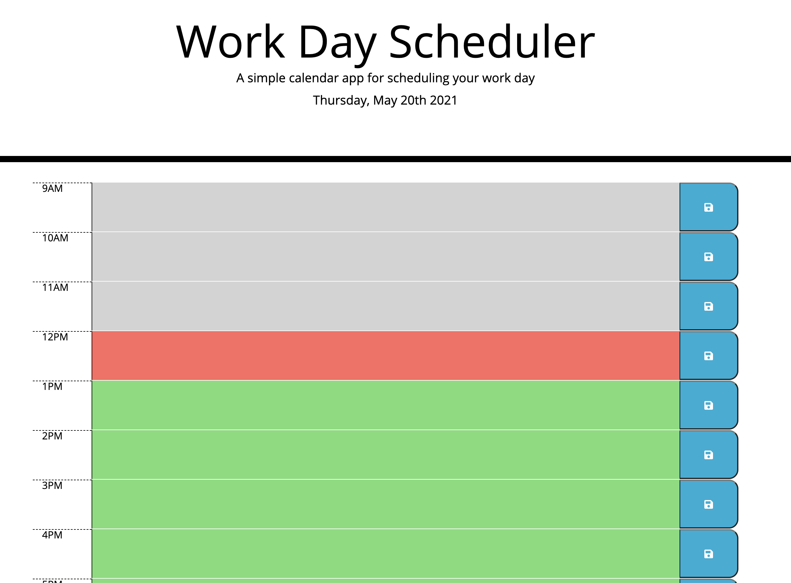

# Third-Party APIs Challenge: Work Day Scheduler

For this weeks challenge we were given an assignment to create a simple calendar application that allows a user to save events for each hour of the day using HTML, CSS, Bootstrap, jQuery as well as the Moments.js library to work with date and time.

## Screenshot Description

Screenshots below show my Work Day Scheduler uploaded in Git Pages.

### Screenshot 1

1. Displays the Work Day Scheduler when the user first opens the planner.
2. Displays the current day at the top of the calender with the use of Moments.js
3. Displays color coded time blocks for standard business hours to indicate whether it is in the past, present or future.

### Screenshot 2

1. Displays the ablility for the user to click into a time block and add input for whatever task they might have.
2. Displays a save button which allows the user to save text for that specific event into local storage so when the page is refreshed the saved events persist.

## URL's

- [URL of the GitHub repository](https://github.com/sdoyle0908/xitrumble)
- [URL of deployed application](https://sdoyle0908.github.io/xitrumble/)
